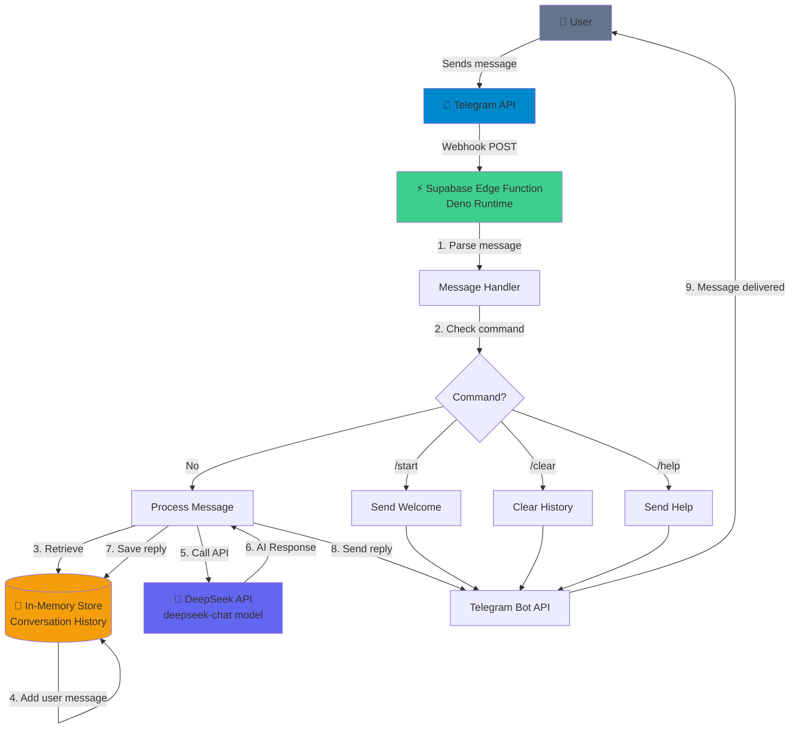

I DON'T NEED OPEN CLAW !!! 
- You don't need to buy mac mini 
- You don't need subscription for expensive cloud services
- You don't need to set up complex infrastructure and understand library
- You don't need to take so much ai bubble to create a simple chatbot
...

# 🤖 Telegram AI Agent — DeepSeek + Supabase Edge Functions

A lightweight, serverless Telegram chatbot powered by **DeepSeek AI** and **Supabase Edge Functions**. No database required — conversation history is handled in-memory.

---

## Demo 


## 📐 Architecture



---

## ✅ Prerequisites

- [Supabase](https://supabase.com) account + project
- [Telegram Bot](https://t.me/BotFather) token
- [DeepSeek API](https://platform.deepseek.com) key
- [Supabase CLI](https://supabase.com/docs/guides/cli) installed

---

## 🚀 Quick Start

### 1. Install Supabase CLI

```bash
npm install -g supabase
supabase login
```

### 2. Initialize & Create Edge Function

```bash
supabase init
supabase functions new telegram-agent
```

### 3. Add the Edge Function Code

Replace the contents of `supabase/functions/telegram-agent/index.ts` with:

```typescript
const TELEGRAM_TOKEN = Deno.env.get("TELEGRAM_TOKEN")!;
const DEEPSEEK_API_KEY = Deno.env.get("DEEPSEEK_API_KEY")!;

// In-memory history per user (lives as long as function instance is warm)
const conversations = new Map<number, { role: string; content: string }[]>();

async function callDeepSeek(messages: { role: string; content: string }[]) {
  const res = await fetch("https://api.deepseek.com/v1/chat/completions", {
    method: "POST",
    headers: {
      "Authorization": `Bearer ${DEEPSEEK_API_KEY}`,
      "Content-Type": "application/json",
    },
    body: JSON.stringify({
      model: "deepseek-chat",
      max_tokens: 1024,
      messages: [
        { role: "system", content: "You are a helpful AI assistant." },
        ...messages,
      ],
    }),
  });

  const data = await res.json();
  return data.choices[0].message.content as string;
}

async function sendTelegram(chatId: number, text: string) {
  await fetch(`https://api.telegram.org/bot${TELEGRAM_TOKEN}/sendMessage`, {
    method: "POST",
    headers: { "Content-Type": "application/json" },
    body: JSON.stringify({
      chat_id: chatId,
      text,
      parse_mode: "Markdown",
    }),
  });
}

async function sendTyping(chatId: number) {
  await fetch(`https://api.telegram.org/bot${TELEGRAM_TOKEN}/sendChatAction`, {
    method: "POST",
    headers: { "Content-Type": "application/json" },
    body: JSON.stringify({ chat_id: chatId, action: "typing" }),
  });
}

Deno.serve(async (req) => {
  try {
    const { message } = await req.json();
    if (!message?.text) return new Response("ok");

    const userId = message.from.id;
    const chatId = message.chat.id;
    const userText = message.text.trim();

    // Commands
    if (userText === "/start") {
      await sendTelegram(chatId, "👋 Hello! I'm your AI assistant powered by DeepSeek. Ask me anything!");
      return new Response("ok");
    }

    if (userText === "/clear") {
      conversations.delete(userId);
      await sendTelegram(chatId, "🗑️ History cleared!");
      return new Response("ok");
    }

    if (userText === "/help") {
      await sendTelegram(chatId, "📖 *Commands:*\n/start - Start bot\n/clear - Clear history\n/help - Show help");
      return new Response("ok");
    }

    // Show typing indicator
    await sendTyping(chatId);

    // Get or init history
    if (!conversations.has(userId)) {
      conversations.set(userId, []);
    }
    const history = conversations.get(userId)!;

    // Add user message
    history.push({ role: "user", content: userText });

    // Keep last 20 messages to avoid token overflow
    if (history.length > 20) history.splice(0, history.length - 20);

    // Call DeepSeek
    const reply = await callDeepSeek(history);

    // Save assistant reply
    history.push({ role: "assistant", content: reply });

    // Send reply
    await sendTelegram(chatId, reply);

  } catch (err) {
    console.error("Error:", err);
  }

  return new Response("ok");
});
```

---

### 4. Set Secrets

```bash
supabase secrets set TELEGRAM_TOKEN=123456789:AAFxxxxxxxxxxxxxxxxxxxxxxxxxxxxxxxxx
supabase secrets set DEEPSEEK_API_KEY=your_deepseek_api_key
```

### 5. Deploy

```bash
supabase functions deploy telegram-agent --no-verify-jwt
```

Your function URL will be:
```
https://<project-ref>.supabase.co/functions/v1/telegram-agent
```

---

### 6. Register Telegram Webhook

```bash
curl -X POST "https://api.telegram.org/bot123456789:AAFxxxxxxxxxxxxxxxxxxxxxxxxxxxxxxxxx/setWebhook" \
  -H "Content-Type: application/json" \
  -d '{"url": "https://<project-ref>.supabase.co/functions/v1/telegram-agent"}'
```

> ⚠️ Replace `123456789:AAFxxx...` with your actual bot token from BotFather, and `<project-ref>` with your Supabase project reference ID.

### 7. Verify Webhook

```bash
curl "https://api.telegram.org/bot123456789:AAFxxxxxxxxxxxxxxxxxxxxxxxxxxxxxxxxx/getWebhookInfo"
```

Expected response:
```json
{
  "ok": true,
  "result": {
    "url": "https://<project-ref>.supabase.co/functions/v1/telegram-agent",
    "has_custom_certificate": false,
    "pending_update_count": 0
  }
}
```

---

## 💬 Chat with Your Bot

1. Open Telegram
2. Search for `@YourBotUsername`
3. Press **Start** or type `/start`
4. Send any message — bot replies via DeepSeek AI ✅

---

## 🤖 Bot Commands

| Command | Description |
|---|---|
| `/start` | Welcome message |
| `/clear` | Clear conversation history |
| `/help` | Show available commands |

---

## 🛠️ Local Development

```bash
# Start local Supabase
supabase start

# Serve function with hot reload
supabase functions serve telegram-agent

# Expose local server for webhook testing
npx ngrok http 54321

# Set local webhook to ngrok URL
curl -X POST "https://api.telegram.org/bot<TOKEN>/setWebhook" \
  -d '{"url": "https://<ngrok-id>.ngrok.io/functions/v1/telegram-agent"}'
```

---

## 📊 Monitoring & Logs

```bash
# Tail live logs
supabase functions logs telegram-agent --tail
```

---

## ⚡ Tech Stack & Pricing

| Service | Free Tier | Notes |
|---|---|---|
| **Supabase Edge Functions** | 2M invocations/month | More than enough for prototypes |
| **DeepSeek API** | Pay-per-use | ~$0.07/1M input tokens, very cheap |
| **Telegram Bot API** | Free | No limits for personal bots |

---

## 📁 Project Structure

```
supabase/
└── functions/
    └── telegram-agent/
        └── index.ts     ← Main edge function
.env                     ← Local env vars (never commit)
README.md
```

---

## ⚠️ Limitations

- **In-memory history** resets if the Edge Function instance goes cold (no persistent DB)
- History is capped at **last 20 messages** per user to avoid token overflow
- Not suitable for high-volume production without adding a database layer

---

## 🔧 Want to Extend?

- **Add Supabase DB** → Persist conversation history across cold starts
- **Add pgvector** → RAG-based knowledge retrieval
- **Switch to Claude** → Replace DeepSeek endpoint with Anthropic API
- **Multi-agent routing** → Route messages to different agents by topic

---

## 📜 License

MIT
